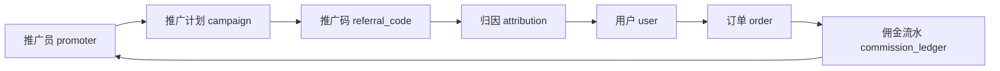

# 小眠 AI 运营管理端设计方案

> 版本：V0.1 · 2026-07-05  
> 状态：设计草案  
> 关联：`sleep-api`（后端）、`sleep-app-rn`（App）、`sleep-app-ui.html`（原型 §03 运营后台）

---

## 1. 背景与目标

小眠 AI 当前具备用户认证、能量体系、商城雏形、专家匹配（客户端 mock）等能力，但**尚无实际管理端**。运营同学无法自助完成：

- 商品上下架与价格调整
- 用户查询与客服支持
- 专家信息维护与上架
- 未来：裂变推广与佣金结算

本方案定义管理端的**信息架构、核心模块、数据模型预留、技术选型与分期落地计划**。

### 1.1 现状摘要

| 域 | 后端（sleep-api） | 客户端（sleep-app-rn） | 缺口 |
|---|---|---|---|
| 用户 | `users` 表 + 登录 API | 已对接 | 无管理列表/封禁/角色 |
| 商品 | `shopProducts.ts` 硬编码 | `energyStore` 本地 richer 模型 | 无 DB CRUD |
| 订单 | `shop_orders` 表 | 购物车/订单在 AsyncStorage | 双轨未打通 |
| 专家 | 无 | `store.ts` 写死 5 人 | 全栈缺失 |
| 支付 | `sandbox_wechat` + 能量 | 本地 `spendEnergy()` | 无真实支付/对账 |
| 推广/裂变 | 无 | 无 | 全栈缺失 |
| 管理端 | 无 `/admin` 路由 | — | 仅 UI 原型 |

---

## 2. 设计原则

1. **按业务域分菜单**，不按数据库表名堆页面。
2. **可发布实体统一模式**：商品、专家、Banner、活动页共用「草稿 → 上架 → 下架」工作流。
3. **用户 360° 视图**：列表负责找人，详情页负责看懂一个人。
4. **裂变独立成「增长中心」**：归因 + 佣金账本，不与用户表耦合。
5. **权限从第一天分开**：C 端 JWT ≠ 管理端 RBAC；敏感字段分级可见。
6. **所有写操作可追溯**：改价、下架、封禁必须记审计日志。

---

## 3. 信息架构（菜单结构）

```
📊 经营总览
   └ 今日 KPI / 待办事项 / 异常告警

👥 用户中心
   ├ 用户列表（搜索、标签、封禁）
   ├ 用户详情（360° 视图）
   └ 会员 / 能量账户

🩺 专家服务                    ← 独立于商品
   ├ 专家库（上架/下架/排序）
   ├ 资质审核
   └ 咨询/预约记录

📦 商品中心
   ├ SPU/SKU 管理（上下架、库存、价格）
   ├ 分类 & 首页推荐位
   └ 虚拟商品（会员、皮肤、能量包）

🛒 交易中心
   ├ 订单列表
   ├ 支付对账
   └ 退款 / 售后

📣 增长中心                    ← 裂变预留
   ├ 推广员管理
   ├ 推广计划（佣金规则）
   ├ 推广码 / 二维码
   ├ 归因记录
   └ 佣金结算

📝 内容运营
   ├ 助眠内容 / 夜校
   └ App 公告 & Banner

⚙️ 系统设置
   ├ 管理员 & 角色权限
   ├ 操作审计
   └ 基础配置
```

> 原型参考：`sleep-app-ui.html` §03 运营管理端（已有数据总览、用户、产品、订单、渠道等，需补充「专家服务」并升级「渠道」为「增长中心」）。

---

## 4. 页面布局

沿用经典 **左侧栏 + 顶栏 + 主内容区**：

```
┌─────────────────────────────────────────────────┐
│ 🌙 小眠运营后台          [搜索]  [通知]  [头像] │
├──────────┬──────────────────────────────────────┤
│ 经营总览  │  面包屑：商品中心 > 商品列表          │
│ 用户中心  │  ┌─────────────────────────────────┐ │
│ 专家服务  │  │ 筛选栏 + [新建] [批量操作]       │ │
│ 商品中心  │  ├─────────────────────────────────┤ │
│ 交易中心  │  │ 表格 / 卡片列表                  │ │
│ 增长中心  │  │                                 │ │
│ 内容运营  │  └─────────────────────────────────┘ │
│ 系统设置  │                                      │
└──────────┴──────────────────────────────────────┘
```

### 4.1 经营总览（首页）

首页只放**今天要处理的**，而非纯展示图表：

| 模块 | 内容 |
|---|---|
| 待办 | 待审核专家、库存预警、待处理退款 |
| KPI | 今日新增用户、DAU、GMV、推广带来用户 |
| 趋势 | 7/30 天注册、订单、收入曲线 |
| 告警 | 支付失败率突增、API 异常等 |

---

## 5. 核心模块设计

### 5.1 商品上下架

#### 统一「可发布实体」字段

| 字段 | 说明 |
|---|---|
| `status` | `draft` / `published` / `archived` |
| `sort_order` | 首页/分类排序 |
| `visible_from` / `visible_to` | 定时上下架 |
| `version` + `published_at` | 改价/改文案留痕 |
| `channels` | `app` / `h5` / `all` |

#### 商品列表页

| 商品 | 类型 | 价格 | 库存 | 状态 | 销量 | 操作 |
|---|---|---|---|---|---|---|
| AI智能睡眠监测带 | 实物 | ¥39.9 | 128 | 🟢 已上架 | 342 | 编辑 / 下架 |

#### 详情页 Tab

- 基础信息
- 价格库存
- 媒体素材（主图、轮播）
- 推荐语（含 AI 生成文案）
- 操作日志

#### 前置依赖

商品 catalog 必须从 `sleep-api/src/config/shopProducts.ts` 和 App 本地数据**迁入 PostgreSQL**，App 改为拉 `/shop/products` API，否则后台改了 App 看不到。

---

### 5.2 用户数据（用户 360°）

#### 列表页能力

- 手机号 / 昵称搜索
- 筛选：注册时间、是否付费、推广来源、用户标签
- 导出（脱敏）

#### 详情页结构

```
用户 138****1234
├ 基础：注册方式、设备、最后活跃、推广来源
├ 睡眠：最近 7/30 天报告摘要（脱敏）
├ 交易：订单、退款、累计消费
├ 能量：余额、流水
├ 专家：咨询/预约记录
├ 社交：发帖、好友（如有）
└ 操作：打标签 / 禁言 / 封禁 / 手动补能量（需审计）
```

#### 权限分级

| 角色 | 可见范围 |
|---|---|
| 客服 | 基础信息、订单、能量摘要 |
| 运营 | + 睡眠报告摘要、标签 |
| 超管 | + 完整敏感数据、封禁、手动调账 |

---

### 5.3 专家服务

专家与商品不同，有资质、排班、匹配权重，**独立建模**。

#### 专家实体字段

| 字段 | 说明 |
|---|---|
| 姓名 / 头像 / 简介 | 展示用 |
| 专业标签 | 失眠、焦虑、CBT-I 等 |
| 资质证书 | 图片 + 审核状态 |
| 服务方式 | 图文 / 语音 / 视频 |
| 价格 | 单次 / 套餐 |
| 可预约时段 | 日历 |
| 匹配权重 | 影响 App「星匹配」排序 |
| `status` | `pending_review` / `published` / `archived` |

#### 工作流

```
运营录入 → 资质审核 → 上架 → App 展示 → 用户预约 → 后台查看咨询记录
```

#### 前置依赖

App `src/data/store.ts` 中写死的 `experts[]` 改为调用 `/experts` API。

---

## 6. 增长中心（裂变 / 推广）

### 6.1 业务场景

> 张三生成推广二维码 → 用户扫码进入 App → 该用户后续消费 → 张三获得佣金。

### 6.2 核心概念

| 概念 | 说明 |
|---|---|
| 推广员（Promoter） | 可发码的人，可以是升级后的普通用户或外部渠道 |
| 推广计划（Campaign） | 佣金规则：比例、有效期、适用商品 |
| 推广码（Referral Code） | 绑定 promoter + campaign，可生成二维码 |
| 归因（Attribution） | 记录 user 通过哪个 code 进来 |
| 佣金流水（Commission Ledger） | 待结算 / 已结算 / 已提现 |

### 6.3 数据流



### 6.4 归因规则（需产品拍板）

| 问题 | 建议选项 |
|---|---|
| 算谁的？ | 首次归因（first-touch）或末次归因（last-touch） |
| 归因窗口 | 如：扫码后 30 天内消费有效 |
| 哪些消费算佣金 | 实付 RMB；是否含能量兑换；退款是否扣回 |
| 佣金比例 | 可按商品类目不同（硬件 5%、虚拟 10%） |
| 结算周期 | T+7 可提现，防退款套利 |

### 6.5 App 侧

- Deep Link / 二维码携带 `ref=CODE`
- 注册或首次打开时写入 `attributions` 表
- 下单时携带 `attribution_id`，订单完成后生成佣金流水

### 6.6 管理端页面

| 页面 | 功能 |
|---|---|
| 推广员列表 | 姓名、带来人数、GMV、待结算佣金 |
| 推广计划 | 创建/编辑佣金规则 |
| 推广码管理 | 生成、禁用、查看扫码次数 |
| 归因明细 | 谁通过谁进来、是否已转化 |
| 佣金结算 | 批次确认、导出、标记已打款 |

---

## 7. 技术选型

| 层 | 方案 | 说明 |
|---|---|---|
| 管理端前端 | 独立项目 `sleep-admin` | React + Vite + Ant Design（或 shadcn/ui） |
| 后端 API | `sleep-api` 新增 `/admin/*` | 复用 PostgreSQL、现有 user/order 表 |
| 鉴权 | RBAC | `admin_users` + `roles` + `permissions`，与 C 端 JWT 分离 |
| 审计 | `admin_audit_logs` | 所有写操作：操作人、时间、前后值 |
| 部署 | `admin.xmianai.com` 或内网 | 建议 IP 白名单 / VPN |

**不建议：**

- 把管理端做进 React Native App
- 第一阶段拆微服务（单体 sleep-api 足够）

---

## 8. 数据库表草案（新增）

### 8.1 管理端基础

```sql
-- 管理员
admin_users (id, username, password_hash, display_name, role_id, status, created_at)
admin_roles (id, name, permissions_json)
admin_audit_logs (id, admin_user_id, action, resource_type, resource_id, before_json, after_json, ip, created_at)
```

### 8.2 商品

```sql
shop_product_categories (id, name, sort_order, status)
shop_products (
  id, category_id, name, description, icon, type,  -- physical | virtual
  energy_price, rmb_price, original_rmb_price,
  stock, status, sort_order, visible_from, visible_to,
  channels, media_json, version, published_at,
  created_at, updated_at
)
```

### 8.3 专家

```sql
experts (
  id, name, avatar_url, bio, tags_json,
  credentials_json, service_types_json,
  price_cents, match_weight,
  status, sort_order, schedule_json,
  created_at, updated_at
)
expert_consultations (
  id, expert_id, user_id, status, scheduled_at, notes, created_at
)
```

### 8.4 增长 / 裂变

```sql
promoters (id, user_id, name, phone, status, created_at)
campaigns (id, name, commission_rate, product_scope_json, valid_from, valid_to, status)
referral_codes (id, promoter_id, campaign_id, code, qr_url, status, created_at)
attributions (id, user_id, referral_code_id, attributed_at, expires_at)
commission_ledger (
  id, promoter_id, order_id, amount_cents, status,  -- pending | settled | withdrawn
  settled_at, created_at
)
```

---

## 9. API 路由规划（`/admin/*`）

| 模块 | 路由示例 |
|---|---|
| 认证 | `POST /admin/auth/login`, `GET /admin/auth/me` |
| 用户 | `GET /admin/users`, `GET /admin/users/:id`, `PATCH /admin/users/:id/status` |
| 商品 | `GET/POST/PATCH /admin/products`, `POST /admin/products/:id/publish` |
| 订单 | `GET /admin/orders`, `GET /admin/orders/:id`, `POST /admin/orders/:id/refund` |
| 专家 | `GET/POST/PATCH /admin/experts`, `POST /admin/experts/:id/review` |
| 增长 | `GET/POST /admin/campaigns`, `GET/POST /admin/promoters`, `GET /admin/commissions` |
| 审计 | `GET /admin/audit-logs` |
| 仪表盘 | `GET /admin/dashboard/summary`, `GET /admin/dashboard/todos` |

所有 `/admin/*` 路由需：`adminAuth` 中间件 + 权限校验 + 写操作审计。

---

## 10. 分期落地

### Phase 1 — 能管起来（4–6 周）

- [ ] 管理员登录 + RBAC
- [ ] 用户列表 + 用户详情（基础）
- [ ] 商品 DB 化 + 上下架 CRUD
- [ ] 订单后台查看（打通 App 本地订单 → API）
- [ ] `sleep-admin` 脚手架 + 登录页 + 商品列表页

### Phase 2 — 专家与交易闭环

- [ ] 专家库 + 审核 + 上下架
- [ ] App 专家数据改拉 API
- [ ] 真实微信支付 + 退款
- [ ] 会员 / 虚拟商品管理

### Phase 3 — 增长与裂变

- [ ] 推广员 + 推广计划 + 二维码生成
- [ ] App Deep Link 归因
- [ ] 佣金流水 + 结算批次

### Phase 4 — 数据与自动化

- [ ] 经营报表、漏斗、渠道 ROI
- [ ] 库存 / 价格 / 佣金异常告警
- [ ] 推广员自助门户（可选）

---

## 11. 待产品拍板的问题

| # | 问题 | 影响 |
|---|---|---|
| 1 | 专家是自营还是入驻？ | 是否需要「专家端」小程序 |
| 2 | 商品以 RMB 还是能量为主？ | 订单与佣金计算逻辑 |
| 3 | 裂变归因用首次还是末次？ | 推广员积极性与规则复杂度 |
| 4 | 客服是否进后台？ | 权限粒度设计 |
| 5 | 是否给渠道商自助看佣金？ | 是否需要推广员门户 |

---

## 12. 相关文件

| 文件 | 说明 |
|---|---|
| `sleep-app-ui.html` §03 | 管理端 UI 原型 |
| `sleep-api/src/config/shopProducts.ts` | 当前商品硬编码 |
| `sleep-api/src/db/migrate.ts` | 现有 DB schema |
| `sleep-api/src/routes/shop.ts` | 现有商城 API |
| `sleep-app-rn/src/data/store.ts` | 专家 mock 数据 |
| `sleep-app-rn/src/data/shopStore.ts` | App 本地订单/购物车 |
| `sleep-app-rn/src/data/energyStore.ts` | App 商品 richer 模型 |

---

## 13. 修订记录

| 版本 | 日期 | 说明 |
|---|---|---|
| V0.1 | 2026-07-05 | 初稿：信息架构、模块设计、裂变预留、分期计划 |
